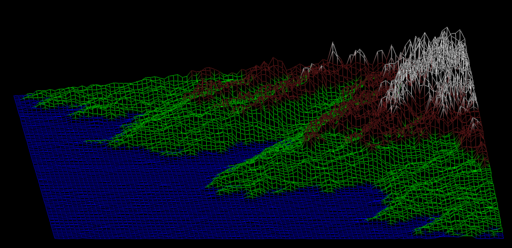

# FilDeFer
coding a visual representation of a map given as text using the minilbx.
We have to  convert a file containing a grid of height  values into a 3d wireframe.

## Example

Map containing colors and a lot of values :

Map containing 2 colors and representing a fractal: 

